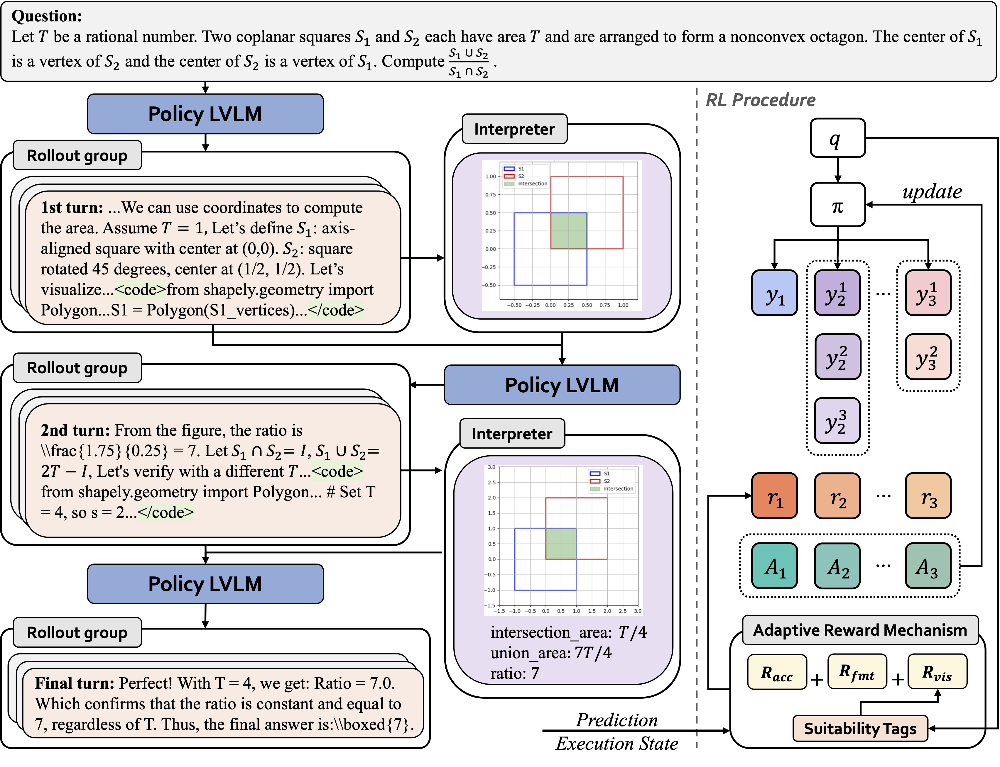

#  FIGR: *Figure It Out* 
This repository contains the **official implementation** of **FIGR**, proposed in the paper:

> **[Figure It Out: Improve the Frontier of Reasoning with Executable Visual States](https://arxiv.org/abs/2512.24297)**

FIGR introduces **active visual thinking** into multi-turn reasoning via **end-to-end reinforcement learning**.
Instead of relying solely on text-based chains of thought, FIGR learns **when and how to construct executable visual states (figures)** during reasoning, enabling more reliable handling of complex geometric and structural constraints.




## ⚙️ Environment Setup

### Install from docker image

```bash
docker pull verlai/verl:app-verl0.5-transformers4.55.4-sglang0.4.10.post2-mcore0.13.0-te2.2
git clone https://github.com/chenmeiqii/FIGR.git && cd verl
pip3 install -e .[sglang]
```

### Interpreter Setup (Sandbox)
Follow the documentation of [SandboxFusion](https://github.com/bytedance/SandboxFusion) to install the interpreter.

Then replace the host name in `examples/sglang_multiturn/config/tool_config/mm_tool_condig.yaml` with yours.

---

## 📊 Data Preparation

FIGR is trained on **DeepMath-103K**, a large-scale, decontaminated mathematical reasoning dataset.
We further enhance the DeepMath-103K dataset by annotating each problem with a **suitability tag**, which indicates whether a problem requires visual/diagrammatic reasoning. Data: [TBD]


### 1. Obtain DeepMath-103K

```python
from datasets import load_dataset
dataset = load_dataset("zwhe99/DeepMath-103K")
```

### 2. Prepare RL training data

**Text-only RL data**

```bash
python examples/data_preprocess/train.py \
  --local_dir data/train
```

**Tool-based (visual) RL data**

```bash
python examples/data_preprocess/train_tool.py \
  --local_dir data/train
```

This will generate `.parquet` files used for RL training.

---

## 🚀 Training

### Multi-turn RL with active visual thinking (FIGR)

```bash
cd examples/sglang_multiturn/32b_mm_multi_turn
bash run_to_qwen3vl_mm_multiturn.sh
```

This script launches **GRPO-based RL training** with:

* Multi-turn rollouts
* Executable visual feedback
* Adaptive visual-invocation rewards

### Text-only RL baseline

```bash
bash run_to_qwen3vl_original_comparison.sh
```

---

## 🙏 Acknowledgements

* This codebase is **built upon the [VeRL](https://github.com/volcengine/verl) framework**
* We thank the authors of:
  * **[DeepMath-103K](https://huggingface.co/datasets/zwhe99/DeepMath-103K)**
  * **[Qwen3-VL](https://huggingface.co/collections/Qwen/qwen3-vl)**
  * **[SGLang](https://github.com/sgl-project/sglang)**
* We are grateful to the open-source community for foundational tools in RL and multimodal reasoning.

---

## 📜 License

This project is released under the **Apache 2.0 License**.
See `LICENSE` for details.

---

## 📖 Citation

If you find this work useful, please cite:

```bibtex
@article{chen2025figr,
  title   = {Figure It Out: Improve the Frontier of Reasoning with Active Visual Thinking},
  author  = {Chen, Meiqi and others},
  journal = {arXiv preprint arXiv:2512.24297},
  year    = {2025}
}
```

